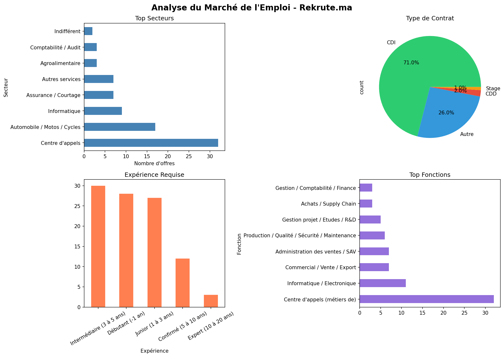

# Job Market Analysis - Morocco

Scraping and automatic analysis of 100+ job offers 
from **Rekrute.ma** — Morocco's leading job portal

---

## Overview



---

## Objective

Understanding the Moroccan job market by analyzing:
- Top sectors recruiting
- Types of contracts offered
- Experience requirements
- Most demanded functions

---

## Key Insights

| Insight | Details |
|---------|---------|
| Top Sector | Call Center (32%) |
| Tech Sector | IT (9%) |
| Main Contract | CDI (71%) |
| Target Profile | Beginner & Junior (55%) |

---

## Technologies

- Python 3.x
- SQLite Database
- Pandas for Data Analysis
- BeautifulSoup for Web Scraping

---

## Project Structure

```
job-market-analysis/
├── Offre_Emplois.ipynb     # Complete code
├── offres_rekrute.csv      # Extracted data
├── emploi_maroc.db         # Database
├── analyse_emploi.png      # Visualizations
└── README.md               # Documentation
```

---

## Installation

```bash
# Clone the project
git clone https://github.com/Boussiline-Omar/analyse-emploi-maroc.git

# Install dependencies
pip install requests beautifulsoup4 pandas matplotlib
```

---

## Project Steps

### 1. Web Scraping
```python
response = requests.get(url, headers=headers)
soup = BeautifulSoup(response.text, "html.parser")
offres = soup.find_all("li", class_="post-id")
```

### 2. Data Analysis
```python
df["Secteur"].value_counts().head(10)
```

### 3. SQL Query
```sql
SELECT Secteur, COUNT(*) as nombre
FROM offres
GROUP BY Secteur
ORDER BY nombre DESC
```

---

## Author

**Omar Boussiline**
- LinkedIn: https://linkedin.com/in/omar-boussiline
- GitHub: https://github.com/Boussiline-Omar
- Email: bossilineomar6@gmail.com

---

⭐ **Si ce projet vous a été utile, n'hésitez pas à lui donner une étoile!**